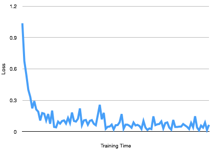
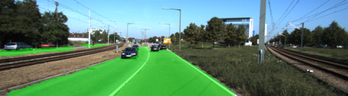
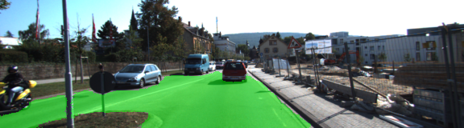
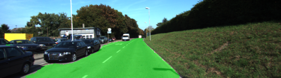
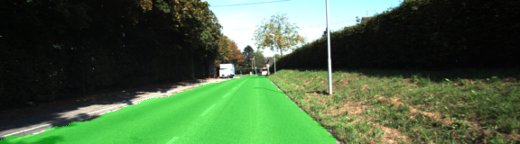

# Semantic Segmentation
### Introduction
The goal of this project is to label road pixels in images using a Fully Convolutional Network (FCN). The Architecture used in this project is  based on the FCN-8 architecture described in this [paper](https://people.eecs.berkeley.edu/~jonlong/long_shelhamer_fcn.pdf)

This network consists of an encoder and a decoder. The encoder is the VGG16 model pre-trained on ImageNet for classification with the fully-connected layer replaced by a 1-by-1 convolution layer.  The decoder up-samples the image back to the original size using a combination of transposed convolutions and skip connections. Skip connections are just a fancy name for an add operation using a decoder layer and a corresponding layer in the encoder. This is a very effective technique for preserving features of the encoding layer and for avoiding information loss.

### Setup
##### Dependencies
 - [Python 3](https://www.python.org/)
 - [TensorFlow](https://www.tensorflow.org/)
 - [NumPy](http://www.numpy.org/)
 - [SciPy](https://www.scipy.org/)

##### Dataset
This project uses [Kitti Road dataset](http://www.cvlibs.net/datasets/kitti/eval_road.php)  that can be dowloaded from [here](http://www.cvlibs.net/download.php?file=data_road.zip).  Extract the dataset in the `data` folder.  This will create the folder `data_road` with all the training and test images.

The network was trained with the Adam Optimizer using the following parameters:
* epochs: 5
* batch size: 1
* learning rate: 0.0001
* dropout: 0.5

The following graph shows that the loss as a function of training time.



To train the network and to perform Semantic Segmentation on all the test images execute the following command.
```
python main.py
```

The results will be saved in the runs directory. Below are some sample images:








